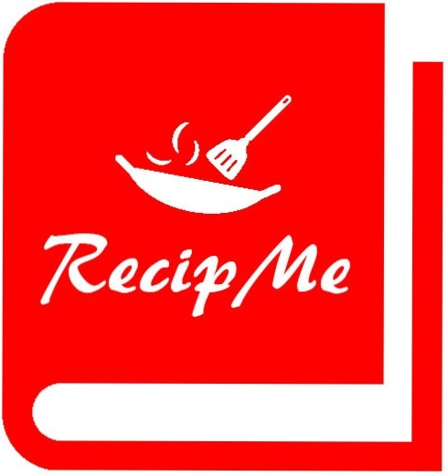

# RecipMe
This mobile app's purpose is to enable users to socially share recipes with other users (signed up to the app).
If this app were to be deployed, it would be deployed on Android mobile phones first (relative version Android Nougat) as it was created in 2016.

Was created as part of a collaboration project using Android Studio (Agile), more information can be found here: 
http://Recipme.esy.es

## Tecnologies used:
Technologies include:
Android Studio
Java
Firebase (Persistent database)
Google Sign in API

## Demo 
View the video to see the pages that were built and the functionality that it beheld
Video Demo can also be found on Youtube: https://bit.ly/3iuutDi

## Functinality 
Functionalities include:
Profile creation
Login/Sign up
Create recipe
Recipe News Feed
Create Shopping List

## Contributing
Pull requests are welcome. For major changes, please open an issue first to discuss what you would like to change.

## License
[MIT](https://choosealicense.com/licenses/mit/)

